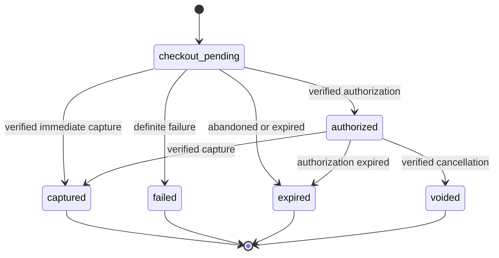
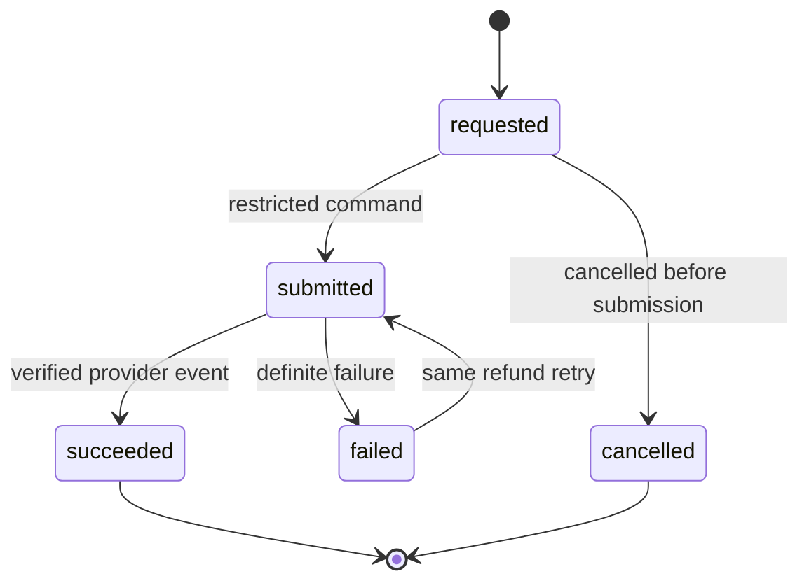
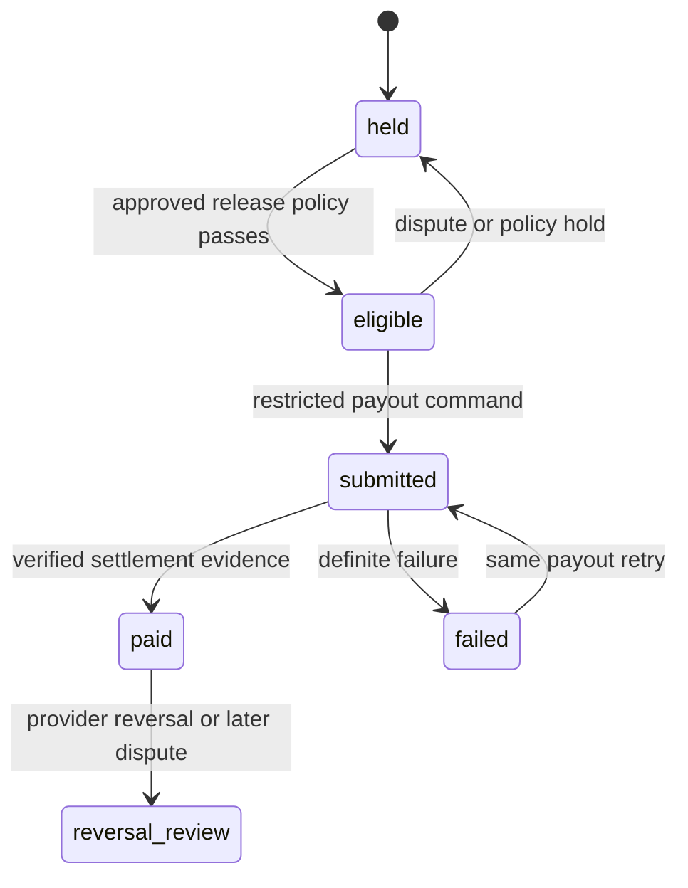

# Care payment, refund and payout contract

Status: M5 proposal for issue #54. This contract is intentionally published
before executable integration. It does not approve pricing, activate Stripe,
create a checkout, move money, apply a migration or change the Care journey.

## Invariants

1. Booking, fulfilment, customer review, payment, refund and technician payout
   are separate authoritative lifecycles. No state in one lifecycle silently
   advances another.
2. The browser never supplies an amount, currency, platform fee, technician,
   payout recipient or refund amount as authority.
3. Every money amount is an integer number of minor units with an explicit
   currency. Initial Care scope permits `AUD` only; floating-point money is
   invalid.
4. Provider acceptance is not the same as captured funds, a succeeded refund
   or a settled payout. Durable state advances only from a verified provider
   response/event whose semantics are documented for that transition.
5. Retry safety is required at Skycar's command boundary, provider request
   boundary and provider webhook boundary.
6. Customer completion confirmation cannot release a payout until a separately
   approved commercial policy and all dispute/hold checks allow it.
7. Payment failure cannot erase a booking or completed work. Refund/payout
   failure cannot be presented as success.

## Authoritative amount and identity sources

The customer command identifies only the journey and intended action. The
server reloads and locks the current records before money work:

| Value | Authoritative source | Browser/provider treatment |
| --- | --- | --- |
| Journey/customer | current `care_journeys` ownership or reviewed guest capability | never accepted from provider metadata alone |
| Selected work | current selected `care_reviewed_quotes` row linked to the journey | quote ID may be a precondition, not authority |
| Charge amount | immutable snapshot of selected quote `total_price_cents` created server-side | no client amount field |
| Currency | selected quote currency, initially exact `AUD` | no client/provider override |
| Technician | selected quote expert plus current technician link | never a browser payout recipient |
| Refund ceiling | succeeded captured amount minus succeeded refunds | provider request cannot exceed it |
| Payout basis | future approved server policy applied to the immutable charge snapshot | unavailable while fee policy is undecided |

The future money order must store the selected quote ID, quote revision or
immutable fingerprint, amount, currency and approved payment-policy version.
Later quote or journey edits cannot mutate that snapshot. A changed quote needs
a new explicitly approved money order; it must not reuse the old provider key.

## Required commercial decisions — deliberately unresolved

Implementation beyond this proposal is blocked until the Product Owner, with
payments/legal/accounting input where required, records these decisions:

| Decision | Required owner | Why code cannot guess |
| --- | --- | --- |
| Charge trigger: booking request, capacity confirmation, pre-work or completion | Product Owner | changes customer promise and failure recovery |
| Immediate capture versus authorization then capture; authorization expiry behavior | Product Owner + payments | changes cancellation and fulfilment dependencies |
| Customer price composition, platform fee, tax/GST treatment and who bears fees | Product Owner + accounting/legal | defines charged and reported amounts |
| Cancellation windows, full/partial refund matrix and non-refundable components | Product Owner + legal | creates financial/customer obligations |
| Customer-issue/dispute hold, evidence, resolution authority and response targets | Product Owner + operations/legal | controls refunds and technician funds |
| Technician payout basis, release trigger, delay, fees, reversals and failed-payout handling | Product Owner + accounting | defines earnings and liabilities |
| Guest payment/recovery policy and whether an account is required before checkout | Product Owner + security/privacy | affects durable access to receipts |
| Provider account, Connect/marketplace model, onboarding/KYC and supported payment methods | Product Owner + payments | determines adapter and recipient model |

Until an accepted policy version exists, a future checkout boundary must return
`PAYMENT_CONFIGURATION_UNAVAILABLE`. The UI continues saying no payment has
been taken; technician expected payout remains unavailable.

## Proposed server boundaries

These routes are a review proposal, not implemented endpoints:

- `POST /api/v1/care/journey/:id/payment-checkouts` — same authorised journey
  customer/capability, trusted origin, exact UUID `Idempotency-Key`, empty body
  or policy-approved non-authoritative fields only. The server derives the
  order amount and returns a short-lived provider handoff plus safe order state.
- `GET /api/v1/care/journey/:id/money` — owner-scoped safe summary of charge and
  refund state. It excludes provider payloads, payment instrument details,
  technician payout data and internal risk/dispute notes.
- `POST /api/v1/webhooks/payments/stripe` — unauthenticated by session but
  authenticated with the configured provider signature over the untouched raw
  body. It returns success for a previously processed valid event.
- Operations refund and payout commands use restricted server/admin boundaries;
  they are not customer or technician direct database writes.

All command responses are private/no-store. Expected denials reveal neither a
foreign journey nor whether it has money records. Direct authenticated writes
to future money tables are revoked.

## Payment state

Absence of a money order is `not_created`, not a stored successful state.

An interrupted browser return stays `checkout_pending` until a server read or
verified webhook establishes the outcome. The browser never converts an
ambiguous network response into success and never creates a second order merely
to recover. A definite failure may start a new attempt under the same money
order with a new attempt ID and provider key.

Provider request idempotency uses a stable attempt ID. Reusing the key with a
changed order, amount, currency, customer or provider operation is
`IDEMPOTENCY_CONFLICT`. Exact replay returns the recorded result after current
journey authority is rechecked.

## Refund state

Refunds are append-only records linked to one captured money order. Multiple
partial refunds are permitted only if an approved policy allows them and the
sum of succeeded refunds plus the new requested amount does not exceed captured
funds.

A refund request does not cancel the appointment, rewrite the quote, reopen
work, resolve a customer issue or reduce technician payout by implication.
Those actions need explicit domain commands. A provider timeout remains
`submitted`/unknown and is reconciled before retry. A definite failure remains
visible and does not claim money was returned.

## Technician payout state

Payout is a separate liability/settlement record. It cannot exist from a UI
calculation or quote alone.

Minimum eligibility inputs are captured customer funds, the exact selected
technician, required completion evidence, the approved customer-review/dispute
rule, no active hold, and a recorded payout-policy version. These inputs do not
define the release timing; that remains a required commercial decision.

If a dispute begins after payout, Skycar records a separate reversal/receivable
review. It must not rewrite a historical `paid` event or silently debit another
job. The technician UI shows no expected/available/paid amount until the server
has the corresponding authorised record.

## Provider event inbox and reconciliation

The webhook boundary must:

1. read the bounded raw body once;
2. verify signature, timestamp tolerance and configured endpoint before JSON
   interpretation;
3. reject invalid signatures without creating an inbox or audit record that
   contains attacker payload data;
4. deduplicate on `(provider, provider_event_id)`;
5. resolve the provider object to exactly one internal attempt/refund/payout;
6. lock that aggregate and validate the transition, amount and currency;
7. append the provider-event receipt, state change and allow-listed audit event
   in one transaction;
8. acknowledge an already committed valid event without repeating effects.

Out-of-order events cannot regress state. Unknown objects, changed
amount/currency, impossible transitions or conflicting metadata go to a
restricted reconciliation queue; they do not advance money or journey state.
Scheduled reconciliation queries pending provider operations by stable provider
ID and records verified results. It does not manufacture success after timeout.

## Future data ownership

A separately reviewed forward migration should create dedicated money records,
not add payment flags to `care_journeys`:

- money orders and immutable amount/policy snapshots;
- provider checkout/authorization/capture attempts;
- refunds with their own idempotency and state;
- technician payout liabilities and attempts;
- verified provider-event inbox/deduplication receipts;
- append-only money audit/reconciliation records.

Database constraints must enforce positive bounded minor units, exact currency,
unique stable command/provider keys, aggregate ownership and refund ceilings.
Public authenticated roles receive no direct insert/update/delete privilege.
Service operations use narrow RPCs/worker roles and transactional locking.

## Logging and sensitive data

Allow-listed logs may include an internal request ID, route template, aggregate
type, internal money record ID, stable result code, attempt count and provider
event type. Logs and customer responses exclude:

- card/payment-method/bank details, checkout URLs and client secrets;
- customer contact/address, technician payout destination and KYC data;
- provider request/response bodies, signatures, credentials and raw errors;
- dispute evidence, private issue text and arbitrary provider metadata.

Provider-facing customer references must be opaque internal IDs. Metadata is
not an authorization source. Audit events identify the authorised actor and
stable action/result without copying sensitive provider payloads.

## Retry and failure rules

- Skycar command idempotency keys are UUIDs scoped to actor, action and target.
- Provider keys are stable internal attempt/refund/payout IDs and survive an
  ambiguous response.
- Retryable infrastructure failures use bounded backoff and reconciliation;
  definite validation, policy or provider rejections are terminal for that
  attempt.
- No retry changes amount, currency, order, recipient or operation.
- A lost browser response is recovered by authoritative read with the same
  Skycar key, never by trusting browser storage as money truth.
- Operational views distinguish pending, retrying, failed, succeeded and
  reconciliation-required states. Alerts use counts/age/codes, not payloads.

## Provider and environment prerequisites

No value is selected or stored by this proposal. Before sandbox integration:

- approved legal Skycar entity/provider account and test-mode access;
- reviewed Stripe account architecture, supported methods and Connect/KYC model;
- protected server-only `STRIPE_SECRET_KEY` and `STRIPE_WEBHOOK_SECRET`;
- reviewed browser publishable configuration such as
  `NEXT_PUBLIC_STRIPE_PUBLISHABLE_KEY` only if the chosen checkout needs it;
- explicit `SKYCAR_PAYMENTS_MODE=disabled|sandbox|live`, defaulting to
  `disabled`, and an accepted `SKYCAR_PAYMENT_POLICY_VERSION`;
- separate webhook endpoints/secrets per environment and documented rotation;
- least-privilege deployment access, audit/alerting, reconciliation schedule,
  backup/restore treatment and provider incident runbook;
- provider sandbox fixtures proving signature, duplicates, out-of-order events,
  interrupted checkout, refunds, disputes and failed payouts;
- #8 staging acceptance before any live-mode or production change.

Secret values never belong in GitHub, logs, fixtures, screenshots or browser
responses. Enabling sandbox/live mode, purchasing services and configuring
hosted credentials remain separately authorised provider/DevOps actions.

## Required implementation handoff

Delivery & Review must first record the accepted commercial policy and allocate
one money-domain migration/backend owner. The implementation packet must name:

1. exact reviewed base revision and unique forward migration timestamp;
2. money tables/RPCs, service roles and RLS/grant proof;
3. provider adapter and raw-body webhook owner;
4. customer/operations/technician response contracts before any UI consumption;
5. disposable PostgreSQL concurrency, rollback, idempotency and amount tests;
6. sandbox event fixtures and reconciliation/monitoring runbook;
7. independent security/finance review and #8 hosted/device/release evidence.

Shared journey, quote, completion and technician UI files remain reserved until
that handoff. Payment integration may read their authoritative state but cannot
rewrite their lifecycle semantics.

## Acceptance for this isolated packet

Executable reference scenarios must prove, without a provider or database:

- amount is derived from a server quote snapshot, never browser input;
- checkout command replay is stable and changed input conflicts;
- duplicate/out-of-order webhook events have one effect and never regress;
- interrupted checkout stays pending until authoritative reconciliation;
- refund failure does not claim success or mutate booking/completion;
- refund totals cannot exceed captured funds;
- customer issue/dispute holds payout without changing captured payment;
- payout needs an explicit policy release and stable retry identity;
- unknown policy leaves checkout and payout unavailable.

Passing these scenarios establishes proposal consistency only. It is not schema,
provider, accounting, legal, hosted, security-review or money-movement evidence.
